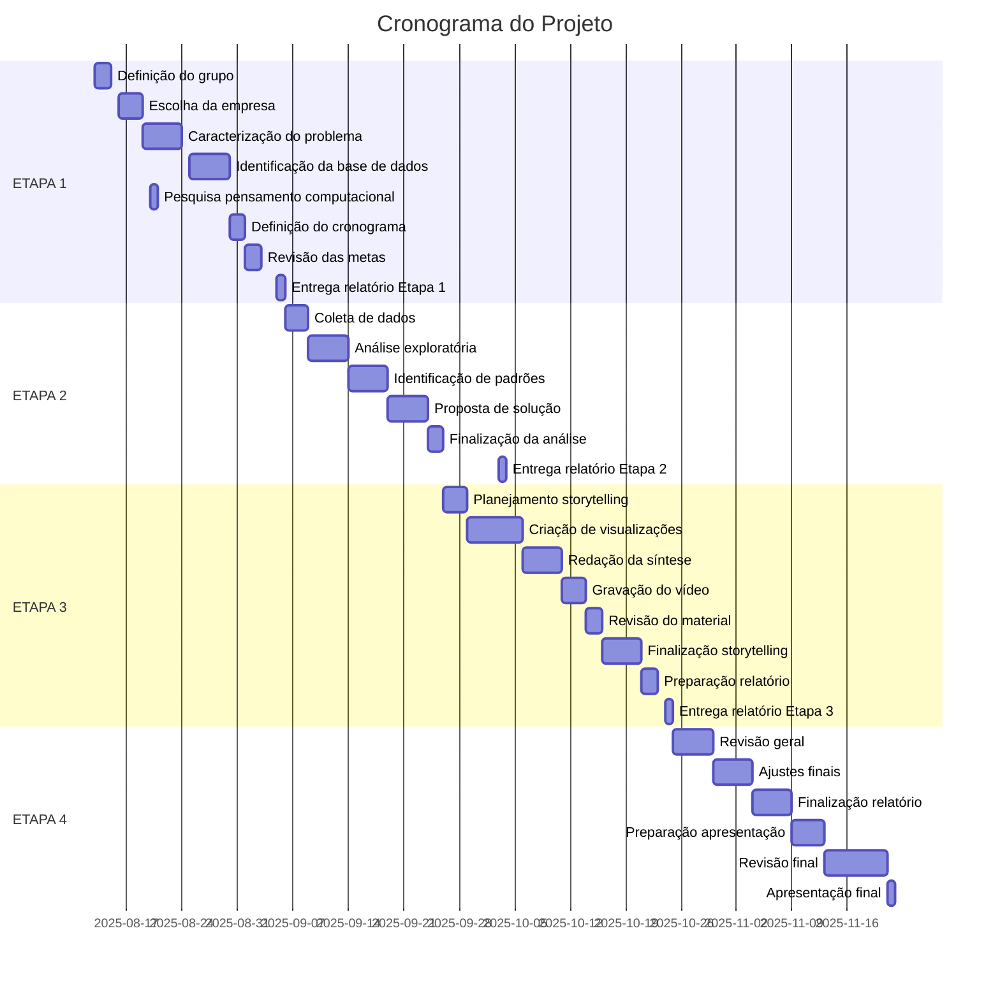

# Projeto Ciência de Dados - Mackenzie (Cronograma Detalhado)

## Visão Geral

Este cronograma detalha as atividades previstas para o projeto de análise de dados, dividido em 4 etapas com datas específicas e responsáveis por cada atividade.

## ETAPA 1 – Planejamento Inicial (20 dias)

**Primeira entrega: 5 de setembro**

| **Período** | **Atividades** | **Responsável** |
| --- | --- | --- |
| 13/08 - 15/08 | Definição do grupo e distribuição de tarefas | Todos |
| 16/08 - 18/08 | Escolha da empresa e contexto organizacional | Enzo Ferroni |
| 19/08 - 24/08 | Caracterização do problema | Vinícius Sabiá |
| 25/08 - 29/08 | Identificação da base de dados | Daniel dos Santos |
| 20/08 - 20/08 | Pesquisa sobre pensamento computacional | Fernanda Guanaes |
| 30/08 - 31/08 | Definição do cronograma de atividades | Vinícius Sabiá |
| 01/09 - 02/09 | Revisão das metas e objetivos | Daniel dos Santos |
| 05/09 | Preparação e entrega do relatório da Etapa 1 | Todos |

## ETAPA 2 – Definição do Produto (28 dias)

**Segunda entrega: 3 de outubro**

| **Período** | **Atividades** | **Responsável** |
| --- | --- | --- |
| 06/09 - 08/09 | Coleta e organização dos dados | Daniel dos Santos |
| 09/09 - 13/09 | Análise exploratória de dados (EDA) | Enzo Ferroni |
| 14/09 - 18/09 | Identificação de padrões e insights | Vinícius Sabiá |
| 19/09 - 23/09 | Elaboração da proposta de solução analítica | Fernanda Guanaes |
| 24/09 - 25/09 | Finalização da análise exploratória | Enzo Ferroni |
| 03/10 | Preparação e entrega do relatório da Etapa 2 | Todos |

## ETAPA 3 – Storytelling (28 dias)

**Terceira entrega: 24 de outubro**

| **Período** | **Atividades** | **Responsável** |
| --- | --- | --- |
| 26/09 - 28/09 | Planejamento do Data Storytelling | Vinícius Sabiá |
| 29/09 - 05/10 | Criação de visualizações e gráficos | Fernanda Guanaes |
| 06/10 - 10/10 | Redação da síntese dos resultados | Daniel dos Santos |
| 11/10 - 13/10 | Gravação do vídeo de 5 minutos | Todos |
| 14/10 - 15/10 | Revisão do material de apresentação | Enzo Ferroni |
| 16/10 - 20/10 | Finalização do Data Storytelling | Todos |
| 21/10 - 22/10 | Preparação do relatório da Etapa 3 | Todos |
| 24/10 | Entrega do relatório da Etapa 3 | Todos |

## ETAPA 4 – Encerramento (28 dias)

**Quarta e última entrega: 21 de novembro**

| **Período** | **Atividades** | **Responsável** |
| --- | --- | --- |
| 25/10 - 29/10 | Revisão geral do relatório final | Todos |
| 30/10 - 03/11 | Ajustes finais na análise e storytelling | Enzo Ferroni |
| 04/11 - 08/11 | Finalização do relatório final | Daniel dos Santos |
| 09/11 - 12/11 | Preparação para a apresentação | Vinícius Sabiá |
| 13/11 - 20/11 | Revisão final e ajustes | Todos |
| 21/11 | Apresentação dos resultados e entrega final | Todos |

## Linha do Tempo

## Divisão de Responsabilidades

| **Membro da Equipe** | **Responsabilidades** |
| --- | --- |
| Enzo Ferroni | • Escolha da empresa e contexto organizacional• Análise exploratória de dados (EDA)• Ajustes finais na análise e storytelling |
| Vinícius Sabiá | • Caracterização do problema• Definição do cronograma de atividades• Planejamento do Data Storytelling• Revisão do material de apresentação• Preparação para a apresentação |
| Daniel dos Santos | • Identificação da base de dados• Redação da síntese dos resultados• Finalização do relatório final |
| Fernanda Guanaes | • Criação de visualizações e gráficos • Elaboração da proposta de solução analítica• Pesquisa sobre pensamento computacional • Finalização do relatório final |

## Marcos Importantes

| **Marco** | **Data Prevista** |
| --- | --- |
| Entrega do Relatório da Etapa 1 | 05/09/2025 |
| Entrega do Relatório da Etapa 2 | 03/10/2025 |
| Entrega do Relatório da Etapa 3 | 24/10/2025 |
| Entrega do Relatório Final e Apresentação | 21/11/2025 |
